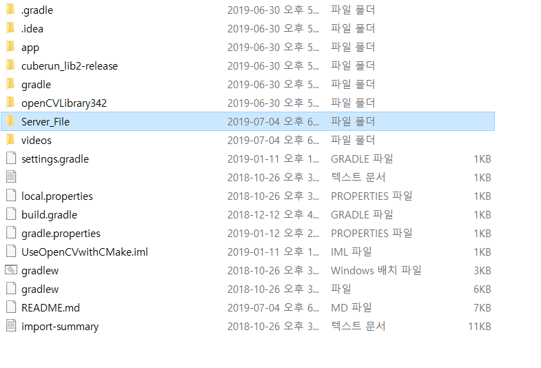
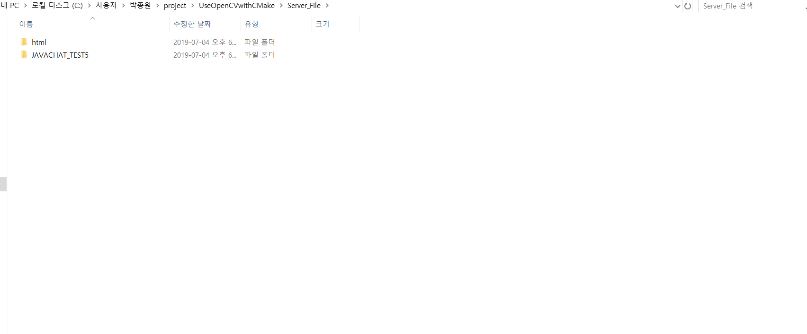
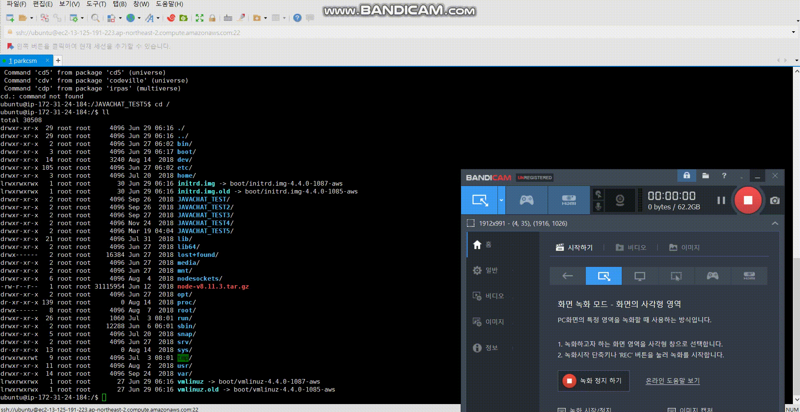
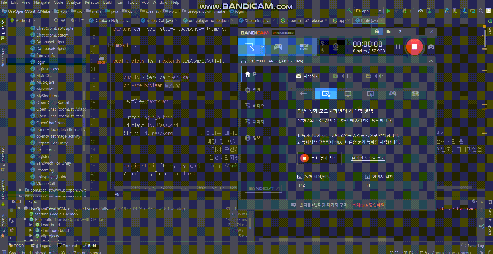

**작품 플레이 영상**
=======================================

**실행전 유의사항**
=======================================
0) 다음 그림과 같이, 서버쪽 코드를 반드시 Linux(웹서버역할-여기서는 AwsEc2사용)에다가 파일로 옮길것!(본인은 FileZila사용), 아래 다른 실행전 유의사항 보면 나오겠지만, html파일은 var/www/html부터 Aws의 주소가 시작되기 때문에, 꼭 이자리에다 넣어야함. 하지만, 실시간 채팅 Java코드는 아무곳에나 넣고, 어플 시작전에 아래 유의사항에서 설명하는대로 실행만 하면됨.

1) 다음과 같이 채팅 서버를 키고 로그인을 진행해야 한다.

2) 다음과 같이 해당 클래스(Streamin, Video_Call) 세션 및 TOKEN값을 수정해줘야 영상통화와 방송기능이 정상적으로 작동한다. (가끔씩 제대로 작동 안할때도 있다.)
이방식은, 토크박스의 무료 서비스를 이용해서 일시적으로 구현한 것이다. 즉 직접 스트리밍,영상통화 서비스를 구축하지 않았다. 그래서 영상통화가 여러명이서 진행이 안되고, 스트리밍(방송) 기능도, 영상통화 기능을 살짝 손대서 야매로 만들었다.
TokBox's WebRTC platform, OpenTok, makes it possible to add live video, voice and messaging to websites, iOS, and Android apps. 30-day free trial.

3) 실행을 위해서, 반드시 서버를 켜줘야한다.(채팅소켓을 연결해줘야하기 때문) 여기서 말하는 서버란 아마존 웹서비스를 말하며, 이 서버를 통해, 데이터가 저장된다.
저장되는 데이터의 종류는 크게, 게시판 데이터, 채팅데이터(오픈채팅,방송채팅)가 있다. 다시 정리하면, EC2 아마존 프리티어(1년무료를 사용)해서, 링크를 받고(일종의 도메인) 이곳에 리눅스(Apache,Php,Mysql)를 설치해서 mysql에 데이터를 저장했다는 말이다. 그리고, 실행전 유의사항 1번을 참고하듯이, 채팅서버를 키고, 로그인을 하게되면,
자동으로 mysql에 채팅데이터가 저장되게된다. (추가사항, 1:1채팅은 SQLite를 활용해서, 기기에 저장되게 했기 때문에 DB에는 저장되지 않는다.)

4) 다음은 파일을 실행하기 위한 DB테이블을 어떻게 설계했는지 보여주는 구조도이다.Linux에 amazon ec2로 설치를하고, amazon 프리티어 ec2링크를 받아서, phpmyadmin에 들어가서 직접 어떤 테이블이 필요할지 고민해보고, 테이블과 칼럼을 만들었다.

5) 다음은, Linux커널(웹서버역할을 하는)에 접속해서, Image파일이 저장되는 부분, 서버역할을 하는 php구문이 작동하는 부분의 파일구조를 찾아보는 영상이다. 안드로이드 클래스 파일을 보면, 서버와의 통신을 하는 다양한 부분에, 기능별로 amazon_ec2link(웹서버역할)/폴더이름/update/***.php 와 같은 식으로 변수가 들어가 있는 것을 확인 할 수 있다.

**만들게 된 계기 및 간단 소감**
=======================================
1. 팀노바라고 하는 코딩교육기관을 다니면서 거기에서 가르치는 응용 1단계 코스를 들음. 24주정도의 시간동안 기본의 채팅이 가능한 어플을 만들었음.(팀노바에서 만든 마지막 작품, 이 이후로 응용 2단계 수업을 블록체인관련해서 선택해서 듣다가 안맞아서 나옴.)
2. Geek_In_The_Group, Lucidreamer가 통신이 안되는 앱이라면, 이것은 웹서버를 이용해서 통신이 되게 구현(자바실시간채팅,게시판글,댓글)
3. 개발 기잔 :2018년 7월 ~ 2018년 12월 
4. Shared Preferencen를 이전에 써봤기 때문에, SQLite를 통해서 채팅내용을 불러와서 저장하려고 시도했고, 칼럼을 어떻게 만들고, 채팅내용을 구분할지 고민하면서 이걸 하면서 많은 공부가 됐음.
5. 음악플레이어, 게시판 등은 기존에 만들었던 Lucidreamer를 그대로 복붙해서 만들었음.
6. 나름 소스효율화+정렬화를 한다고 변수 선언부와, 메소드 부분을 조금 다듬으면서 하긴 했는데, 중복코드가 아주 많음.
7. 이런저런 기능들(게임,영상통화+스트리밍,OpenCv,이더전송)을 때려넣는다고 복사붙여넣기를 하다보니, 네이티브 자체 크기가 너무 커졌음.
8. 사실상 실용앱이라기보다는 그동한 배운것을 정리하고 공부하기 위해서 만들었음.
9. 시연 영상에는 없지만, 게시판에서 친구를 찾아서, 친구 추가 신청을 하고 해당 신청을 받아들이는 부분이 있음.
10. 채팅방을 구분하는 기능을 자바클래스로 구현하면서 많은 공부가 됐음. 배열을 사용하고, 해쉬테이블, 해쉬맵에 대한 고민도 하게됐음. 또한, 실시간 채팅을 위해 Service를 사용하면서, 통신에 연결되고 끊어지는 것과 생명주기 등에 대해서 많은 공부가 됐음.
11. 얼굴인식 사진찍기 OpenCv를 가져다 쓰면서, 많은 고생을 했음. 왜냐하면 OpenCv가 C코드로 이뤄져 있는데, 이것을 안드로이드 스튜디오에서 실행시키기위해 예제를 살펴보며 많은 고생을 함. 특히 카메라를 가로세로로 돌렸을 때도 얼굴을 인식하는 부분이 매우 어려워서, 이 부분 공부하면서 많은 고생을 함.
12. 뭔가 새로운 기능을 추가할때마다 Gradle, API버전, Manifest 등이 계속해서 충돌했기 때문에, 고생을 많이 했음.
13. 게임은 유튜브를 보면서 따라해서 만들었고, Unity를 통해 만들었음. 안드로이드 기기와 연동해서 Library형태로 저장하는등 기기에서 Unity게임에 접속할 수 있게하느라 애좀 먹음.
14. 이더리움 전송하는 것은, 깃허브에서 작동하는 코드를 하나 찾아다가 그대로 붙임. 이더와 토큰전송하는 메타마스크라는 프로그램 깔아서, 공부하고, web3j에 대해서 공부하고 했으나, 이론적으로 공부만했지, 코드로
손을 대지 못함.
15. 그래도 결과적으로, 클라이언트와 서버쪽 코드를 손대보고, 여러가지 프로그래밍 전반에대해서 제대로 고민해보고 배울 수 있는 기회였음. 조금씩 내가 생각한대로 앱이 구현될때마다 짜릿한 느낌마저 들었고, GitHub를 잘 이용하면 더 좋은 앱을 만들 수 있을 거라는 생각도 들었음.

**기능 소개**
======================================
1. 회원가입&로그인
2. 다중 채팅
3. 영상통화
4. 스트리밍
5. 뉴스기사보기
6. 게임
7. 음악듣기
8. 게시판(얼굴인식 사진찍기)
9. 이더리움 전송 및 잔액확인.

